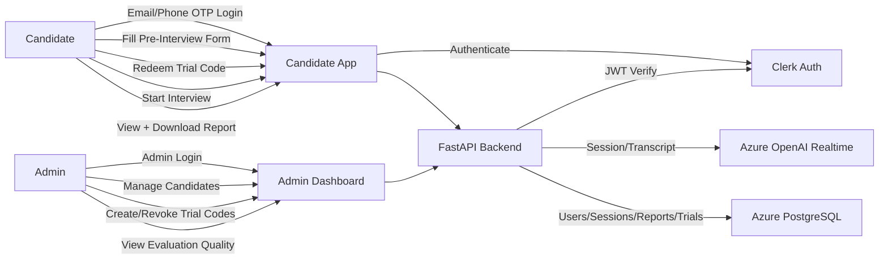
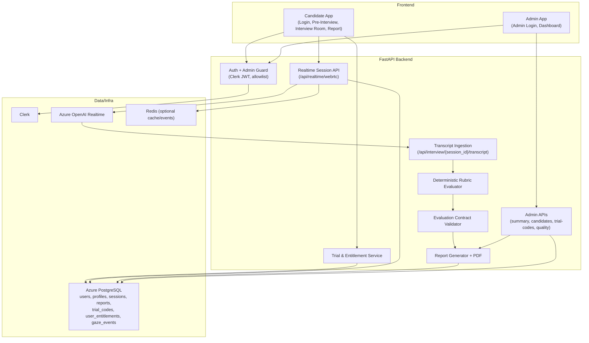

# Evaluate Yourself - Use Case and Functional Diagrams

## Use Case Diagram

## Functional Architecture Diagram

## PaperBanana Inputs

- Use case input text: `/Users/srujanreddy/Projects/evaluate-yourself/docs/diagrams/use-case-input.txt`
- Functional input text: `/Users/srujanreddy/Projects/evaluate-yourself/docs/diagrams/functional-diagram-input.txt`

## Rendered Diagram Files

- Use case SVG: `/Users/srujanreddy/Projects/evaluate-yourself/docs/diagrams/use-case.svg`
- Functional architecture SVG: `/Users/srujanreddy/Projects/evaluate-yourself/docs/diagrams/functional-architecture.svg`
