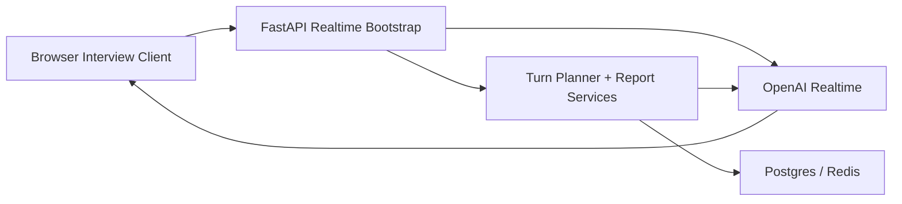
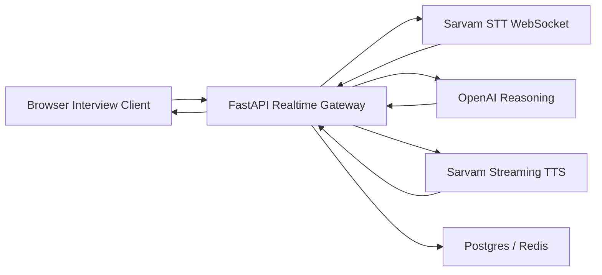

# Realtime Provider Architecture

## Goal

Keep the candidate-facing interview flow stable while allowing the backend to swap between a native OpenAI realtime path and a Sarvam-plus-OpenAI hybrid path.

## Canonical frontend contract

The frontend should continue to depend on one backend-owned interview bootstrap surface and one event stream contract.

Recommended shape:

- `POST /api/realtime/session`
  Starts or negotiates a live interview session
- `WS /api/realtime/session/{session_id}`
  Streams user audio, Sonia events, transcripts, and status updates

The current code still uses `POST /api/realtime/webrtc` and `POST /api/realtime/sessions`. Those should be treated as migration-era transport endpoints, not the final provider-specific surface.

## Mode 1: OpenAI native

Behavior:

- backend creates or negotiates the realtime session
- browser talks through the supported realtime transport
- transcript, capture, and report persistence stay backend-owned

## Mode 2: Sarvam hybrid

Behavior:

- browser sends live audio to the backend gateway
- backend forwards speech to Sarvam STT
- backend sends final or incremental transcript turns to OpenAI reasoning
- backend requests Sonia audio from Sarvam TTS
- backend forwards Sonia audio and runtime events back to the browser

## Interfaces the backend must own

To keep the frontend stable, the backend should own these normalized interfaces:

- `RealtimeSessionProvider`
- `StreamingTranscriptionProvider`
- `TurnReasoningProvider`
- `StreamingTtsProvider`

That separation matters because OpenAI can satisfy all four in one native mode, while Sarvam hybrid needs speech and reasoning split across vendors.

## Candidate-facing runtime guarantees

Regardless of provider mode, the browser should keep the same observable runtime guarantees:

- Sonia opens the interview
- listening and speaking badges are accurate
- transcript events arrive once per committed turn
- degraded provider fallback is visible
- report generation uses backend-owned trusted evidence paths
